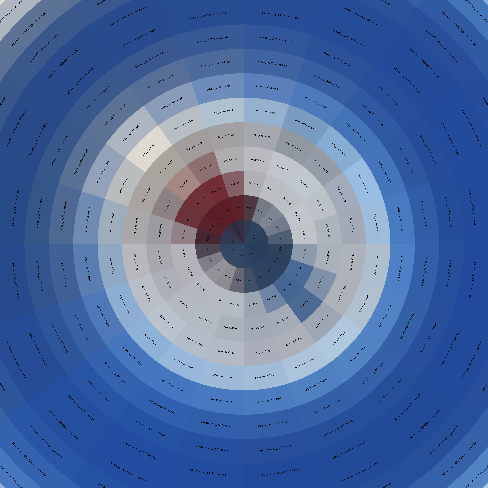

# Fisheye

Equirectangular to fisheye maker!

Sorry, macOS only …

**Depends on:** [ImageMagick](https://imagemagick.org/)

## Example

### Input

**Equirectangular:**


### Output

**Tiny Planet:**



**Big Sky:**


## Options

option | description | default
--- | --- | ---
`view` | conversion view type: `tiny-planet` or `big-sky` | random view type
`image` | **required**, local path to equirectangular image | `undefined`
`directory` | output directory if different from `image` | input image’s directory
`name` | specify name of output image | input image’s name

## Usage

See: [`example.js`](./test/example.js)

**Result if successful:**

```js
{
  code: 0,
  command: 'tiny-planet',
  input: '/Users/…/fisheye/input.jpg',
  output: '/Users/…/fisheye/test/output_tiny-planet.jpg'
}
```

Throws an `Error` otherwise.

## Thanks!

A **HUGE** thanks goes out to these folks:

- [fmw42](https://imagemagick.org/discourse-server/memberlist.php?mode=viewprofile&u=9098) (aka Fred of [Fred’s ImageMagick Scripts](http://www.fmwconcepts.com/imagemagick/index.php))
- [GeeMack](https://imagemagick.org/discourse-server/memberlist.php?mode=viewprofile&u=31324)
- [snibgo](https://imagemagick.org/discourse-server/memberlist.php?mode=viewprofile&u=16096)

**Links:**

- [Reverse polar coordinates?](https://imagemagick.org/discourse-server/viewtopic.php?t=35817)
- [Rule of thumb: When to use +repage?](https://imagemagick.org/discourse-server/viewtopic.php?t=35826)
- [PANO2FISHEYE](http://www.fmwconcepts.com/imagemagick/pano2fisheye/index.php)

## License

Copyright © 2019 [Michael Hulse](http://mky.io).

Licensed under the Apache License, Version 2.0 (the “License”); you may not use this work except in compliance with the License. You may obtain a copy of the License in the LICENSE file, or at:

[http://www.apache.org/licenses/LICENSE-2.0](http://www.apache.org/licenses/LICENSE-2.0)

Unless required by applicable law or agreed to in writing, software distributed under the License is distributed on an “AS IS” BASIS, WITHOUT WARRANTIES OR CONDITIONS OF ANY KIND, either express or implied. See the License for the specific language governing permissions and limitations under the License.
